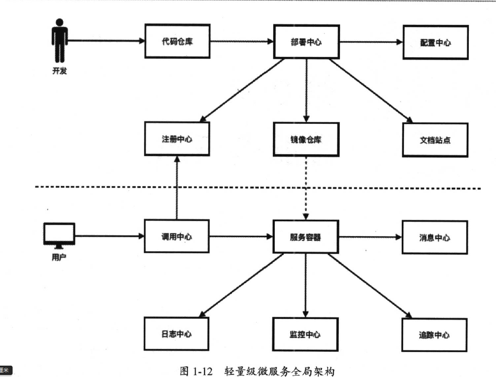

# 轻量级微服务学习笔记

[TOC]

## 传统单应用架构问题

- 修改一个Module需要部署整个应用，部署效率低

- 系统资源浪费

- 技术选型单一

  

## 微服务架构概述

- 根据业务模块划分服务种类
- 每个服务可独立部署且相互隔离
- 通过轻量级API调用服务
- 服务需要保证良好的高可用性

### 特点

- 微小度颗粒
- 责任单一性
- 运行隔离性
- 管理自动化

### 挑战

- 运维要求高
- 分布式复杂性
- 部署依赖较强
- 通信成本较高

### 个人总结

​	单体应用拆分成微服务，随着服务越来越多，开发和发布应该自动化，运维和监控也应该自动化，开发组织也要做出相应的调整。	

## 微服务开发框架Spring Boot

### 特点

- 可创建独立spring应用独立jar包
- 提供嵌入式Web Server
- 不需要任何xml配置
- 自动化配置
- 提供一系统生产级特性
- 大量开箱即用Spring插件

### Actuator

- 获取自动配置信息(autoconfig)
- 获取SpringBean基本信息
- 获取配置项信息
- 获取当前线程信息
- 获取环境变量信息
- 获取健康检查
- 获取应用基本信息
- 获取性能指标
- 获取请求映射信息
- 获取请求调用信息

## 微服务注册与发现

### [zookeeper](https://zookeeper.apache.org/)

#### ​特性

- 顺序性指同一个客户端发送的请求，最终将会严格按照其发送顺序进入ZooKeeper中
- 原子性指所的请求的响应结果在整个分布式集群环境中具备原子性，要么整个集群所有机器都成功处理某一个请求，要么就都没有处理
- 单一性 无论客户端连接到那个ZooKeeper服务器，每个客户端看到的服务端数据模型都是一致的，不可能出现两种不同的数据状态
- 可靠性 一旦服务端数据状态发生了变化，就会立即存储起来，除非有另一个请求对其进行了变更，否则数据一定是可靠的
- 实时性 当某个请求被成功处理后，客户端能够立即获取服务端的最新数据状态，整个过程具备实时性

#### 模型

ZooKeeper内部维持一个树状的内存模型，类似文件系统，有根节点和子节点，有以下几种节点类型:

- 持久节点
- 持久顺序节点	
- 临时结点
- 临时顺序结点

#### 过程

 	web服务启动时，通过ServletContextListener 的contextInitialized自动注册到ZooKeeper中, 在ZooKeeper中创建相应的结点 /registry/{servcieName}/{address} ， 客户端带有ServiceName信息调用服务网关，网关根据ServiceName查询ZooKeeper的存储的服务地址信息，网关取得了服务地址，将请求转发至服务地址

## 轻量级微服务架构

#### 架构师

- 架构师职责制定规范 + 指导落地
- 硬技能 众多技术领域上都有一定深度
- 软技能 沟通，组织， 学习等

#### 微服务架构师职责

- 分析业务需求并切分微服务边界
- 定义架构规范与文档标准
- 确保微服务架构顺利落地
- 改善微服务架构并提高开发效率

#### 微服务冰山模型

  	表面: 开发框架和容器技术

​	支撑: 注册中心，调用中心，部署中心，日志中心，监控中心， 追踪中心， 消息中心，配置中心,  安全中心, 文档中心

#### 微服务切分

  	第一步梳理业务流程 

​	第二步抽取公共服务，如邮件发送，文件上传, 第三方接口等 

​	第三步定义业务服务 先大切几块，确保每个服务之间不要有依赖关系，后续再进行细化，拆分为更小服务

​	第四步设计数据模型

​	第五步 定义服务接口  确保api职责单一，需要通过名称能识别出业务含义，确保每个api命名全局唯一，每个		api各自版本号

#### 微服务全局架构图

​	

